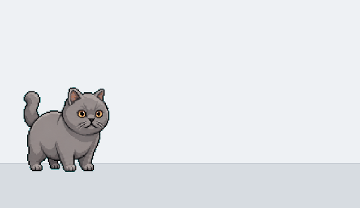

# Pawble

Pawble lets your pet live on your Mac desktop.



## Create Your Pet

After cloning this repo:

1. Put one clear photo of your pet here:

```text
pet-photos/<pet-name>.jpg
```

Example:

```text
pet-photos/blueberry.jpg
```

2. Ask Codex:

```text
Create and install a Pawble pet named blueberry.
```

Codex should generate the pet, check that it loads, install the Mac app, and open it.
